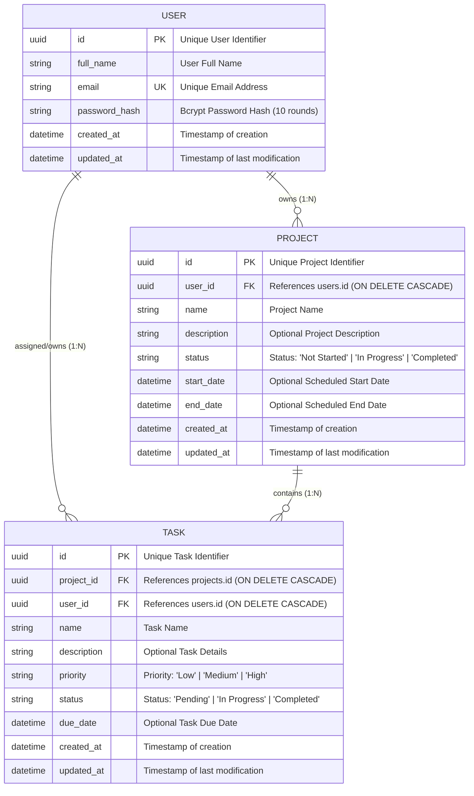

# Database Schema & Entity Relationship (ER) Diagram

This document details the normalized relational database architecture for the **Project Management System (Web + Mobile)** built with **PostgreSQL** and managed via **Prisma ORM**.

---

## 1. Entity-Relationship Diagram (Mermaid)

---

## 2. Table Specifications & Normalization

### 2.1 `users` Table
Stores authenticated account credentials.
- **Primary Key**: `id` (`UUID`, generated via `@default(uuid())`)
- **Indexes / Constraints**: `email` is strictly unique (`@unique`).
- **Security**: `password_hash` stores bcrypt hash (10 salt rounds). Plaintext passwords are never stored.

| Column | Data Type | Nullable | Default | Description |
|---|---|---|---|---|
| `id` | `UUID` | No | `uuid_generate_v4()` | Unique primary key |
| `full_name` | `VARCHAR(255)` | No | - | User display name |
| `email` | `VARCHAR(255)` | No | - | Unique login email |
| `password_hash` | `VARCHAR(255)` | No | - | Bcrypt hashed password |
| `created_at` | `TIMESTAMP` | No | `now()` | Registration timestamp |
| `updated_at` | `TIMESTAMP` | No | `now()` | Last profile update |

---

### 2.2 `projects` Table
Stores user projects. Each project is strictly owned by one authenticated user.
- **Primary Key**: `id` (`UUID`)
- **Foreign Key**: `user_id` references `users(id)` with `ON DELETE CASCADE`.
- **Status Enum Values**: `'Not Started'`, `'In Progress'`, `'Completed'`.

| Column | Data Type | Nullable | Default | Description |
|---|---|---|---|---|
| `id` | `UUID` | No | `uuid_generate_v4()` | Primary Key |
| `user_id` | `UUID` | No | - | FK to `users.id` |
| `name` | `VARCHAR(255)` | No | - | Project title |
| `description` | `TEXT` | Yes | `NULL` | Project scope/notes |
| `status` | `VARCHAR(50)` | No | `'Not Started'` | Current status |
| `start_date` | `TIMESTAMP` | Yes | `NULL` | Project kickoff date |
| `end_date` | `TIMESTAMP` | Yes | `NULL` | Scheduled deadline |
| `created_at` | `TIMESTAMP` | No | `now()` | Creation timestamp |
| `updated_at` | `TIMESTAMP` | No | `now()` | Update timestamp |

---

### 2.3 `tasks` Table
Stores actionable tasks assigned within a project and owned by the user.
- **Primary Key**: `id` (`UUID`)
- **Foreign Keys**:
  - `project_id` references `projects(id)` with `ON DELETE CASCADE`.
  - `user_id` references `users(id)` with `ON DELETE CASCADE`.
- **Priority Enum Values**: `'Low'`, `'Medium'`, `'High'`.
- **Status Enum Values**: `'Pending'`, `'In Progress'`, `'Completed'`.

| Column | Data Type | Nullable | Default | Description |
|---|---|---|---|---|
| `id` | `UUID` | No | `uuid_generate_v4()` | Primary Key |
| `project_id` | `UUID` | No | - | FK to `projects.id` |
| `user_id` | `UUID` | No | - | FK to `users.id` |
| `name` | `VARCHAR(255)` | No | - | Task title |
| `description` | `TEXT` | Yes | `NULL` | Task instructions |
| `priority` | `VARCHAR(50)` | No | `'Medium'` | `'Low' \| 'Medium' \| 'High'` |
| `status` | `VARCHAR(50)` | No | `'Pending'` | `'Pending' \| 'In Progress' \| 'Completed'` |
| `due_date` | `TIMESTAMP` | Yes | `NULL` | Due deadline |
| `created_at` | `TIMESTAMP` | No | `now()` | Creation timestamp |
| `updated_at` | `TIMESTAMP` | No | `now()` | Update timestamp |

---

## 3. Relational Integrity & Security Rules

1. **Cascade Deletes**:
   - When a `User` is deleted, all their associated `projects` and `tasks` are automatically removed.
   - When a `Project` is deleted, all child `tasks` under that project are automatically deleted.
2. **Strict Multi-Tenant Isolation**:
   - Every read, update, and delete query validates `userId = req.user.id`.
   - Creating a task checks that `projectId` belongs to the requesting user, preventing cross-tenant injection.
